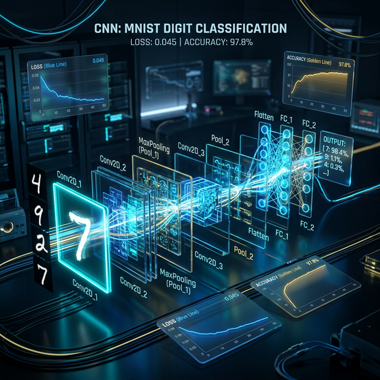

<div align="center">

</div>

# CNN 3D Vizuelizacija

Sve što vam je potrebno za lokalno pokretanje aplikacije.
Proverite aplikaciju na:
https://blagojevicboban.github.io/cnn-arvr/

View your app in AI Studio: https://ai.studio/apps/3e02985d-3179-4aa2-ac17-a85437ace644

## Run Locally

**Prerequisites:**  Node.js

1. Install dependencies (this will also pull in TensorFlow.js used by the on‑worker model):
   ```bash
   npm install
   ```
2. Set the `GEMINI_API_KEY` in [.env.local](.env.local) to your Gemini API key if you plan to use the Google GenAI portion.
3. Start the development server:
   ```bash
   npm run dev
   ```

---

### Notes on the CNN Demo

The project now uses a **TensorFlow.js** convolutional model running inside a Web Worker for both inference and training.

- **Inference**: Worker performs convolutions and pooling off the main thread, returning feature maps and probabilities.
- **Training**: Real in-browser training on user-collected datasets. Supports pause/resume, checkpoints (saved to localStorage), and history export.
- **Data Collection**: Interactive dataset building - upload images, assign labels (0-9), and train on your own data instead of synthetic patterns.
- Model architecture mirrors the 5-layer network shown in the 3-D scene.
- Can be extended with real datasets or swapped for ONNX/TFLite models.

This setup demonstrates true ML integration: collect your own training data, train the model live, and see real convergence!

#### How to Use Data Collection

1. **Open Data Collection Panel**: Click the green "Data Collection" panel on the left side of the screen.
2. **Select Label**: Choose a digit (0-9) that represents what you want to train the model to recognize.
3. **Add Images**: 
   - Use sample images from the "Input Data" panel, or
   - Upload your own images using the "Upload Image" button
4. **Add to Training Data**: Click "Add Current Image" to convert the selected image to 28x28 grayscale and add it to your training dataset.
5. **Train**: Once you have collected some data, click "Start" in the Training Monitor panel to begin training on your custom dataset.
6. **Monitor Progress**: Watch the loss and accuracy curves update in real-time as the model learns from your data.

The model will learn to recognize the patterns in your collected images and classify new images accordingly!

